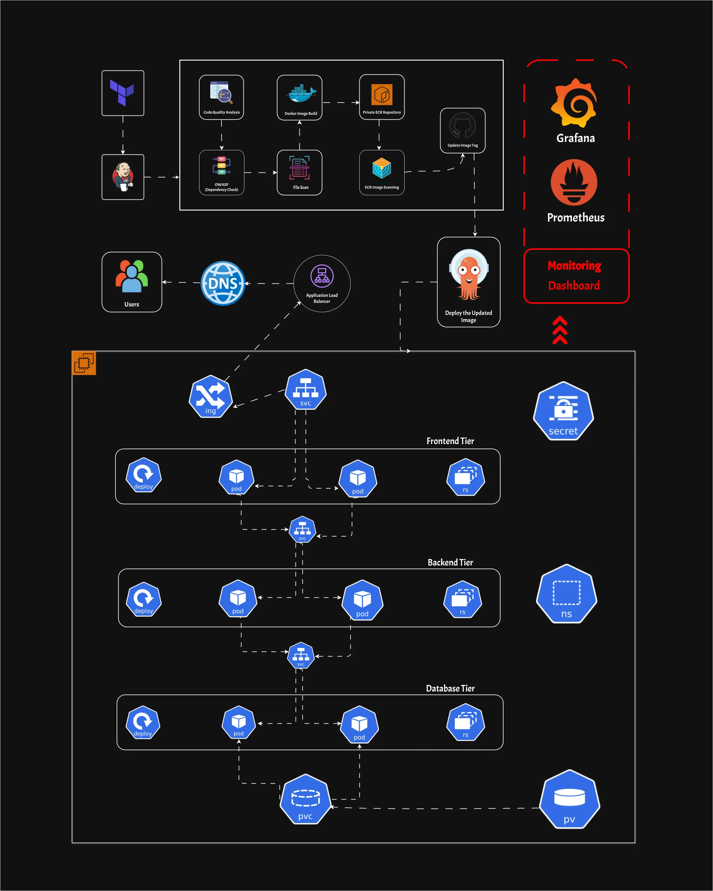

# 🚀 Advanced End-to-End DevSecOps Kubernetes Project  

## 🔍 Project Overview  
This project demonstrates a **secure, scalable, and fully automated** DevSecOps pipeline for deploying a three-tier **MERN application** on **AWS EKS**. It integrates **Infrastructure as Code (IaC), CI/CD automation, GitOps, security scanning, and monitoring**, ensuring a production-ready cloud-native deployment.🛳️ 

## 🏗️ Key Highlights  
- **Infrastructure as Code (IaC)** – Automated provisioning of AWS resources using **Terraform**.  
- **CI/CD & GitOps** – Seamless build, test, and deployment pipelines with **Jenkins** and **ArgoCD**.  
- **Security Integration** – Static and dynamic security analysis with **SonarQube, OWASP Dependency Check, and Trivy**.  
- **Monitoring & Observability** – Real-time insights using **Prometheus and Grafana**.  

This project is a **Blueprint for Building Secure, Automated, and Scalable Cloud-Native Applications** using the best DevSecOps practices. 🚀

## 🛠️ **Tools & Technologies Used**  
- **Infrastructure as Code**: 🏗️ Terraform  
- **CI/CD Pipeline**: 🛠️ Jenkins  
- **GitOps**: 🚀 ArgoCD  
- **Security**: 🔒 SonarQube, 🛡️ OWASP Dependency-Check, 🕵️ Trivy  
- **Monitoring**: 📊 Prometheus, 📈 Grafana  
- **Cloud Platform**: ☁️ AWS EKS
  
